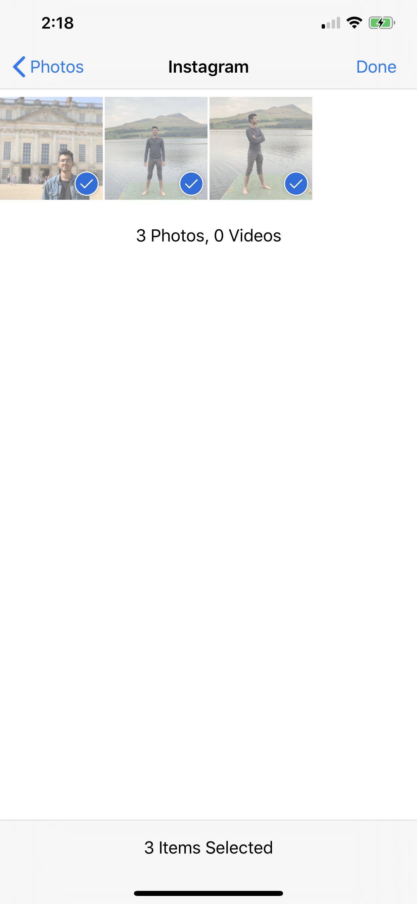
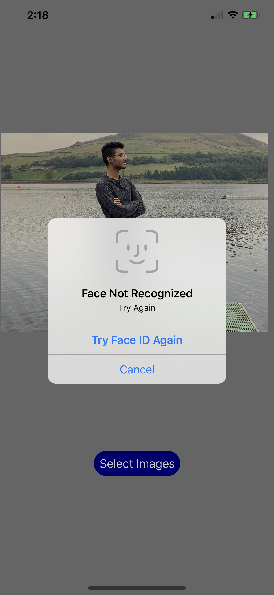

iOS/Android app that uses Face ID or Touch ID before you select photos from your phone. 
This way you can show a friend a few photos without having them snooping around.

1. You would use your Face ID or Touch ID to get access to your photos

2. Select your photos

3. Show your friends 

If they try to select photos for themselves they won't be able to unlock it without your face or touch ID

